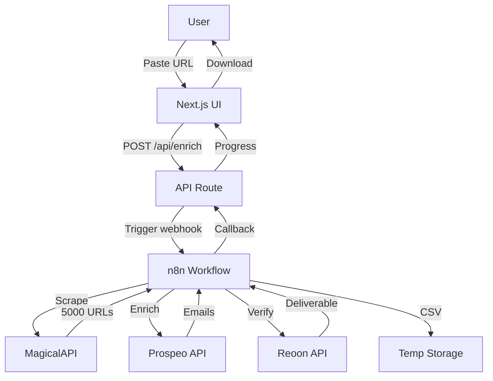
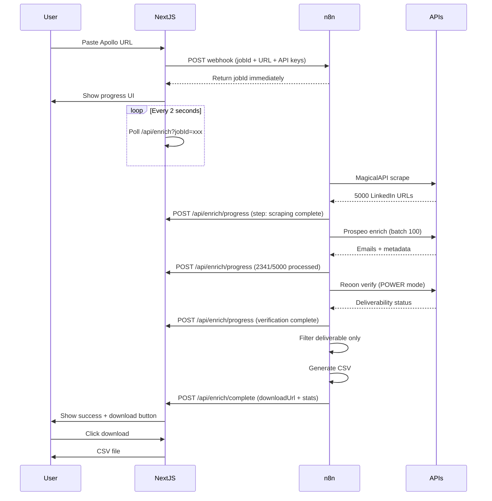

# Architecture

## System Overview



## Data Flow



## Component Structure

```
app/
├── page.tsx (State machine: idle | processing | complete | error)
├── layout.tsx (Dark theme wrapper)
└── api/
    └── enrich/
        ├── route.ts (POST: trigger, GET: poll)
        ├── progress/route.ts (n8n callback)
        └── complete/route.ts (n8n callback)

components/
├── EnrichmentForm.tsx (Input + validation)
├── ProgressTracker.tsx (Live progress display)
├── ResultsDownload.tsx (Stats + CSV download)
└── SettingsModal.tsx (API key config)

lib/
├── types.ts (TypeScript interfaces)
├── progress-store.ts (In-memory Map)
├── storage.ts (Encrypted localStorage)
└── n8n.ts (Webhook client)
```
